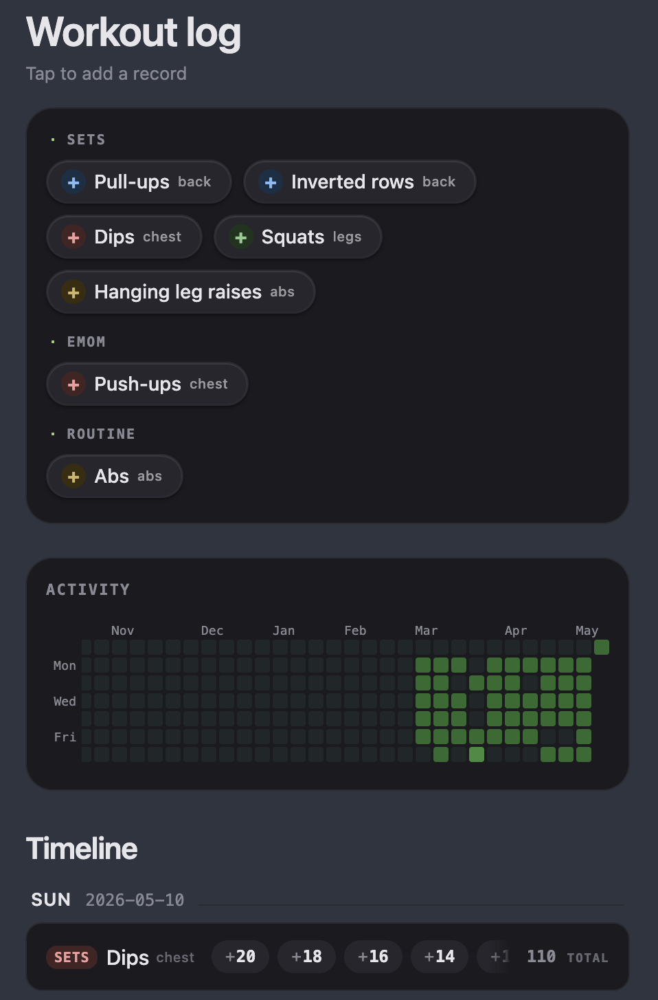
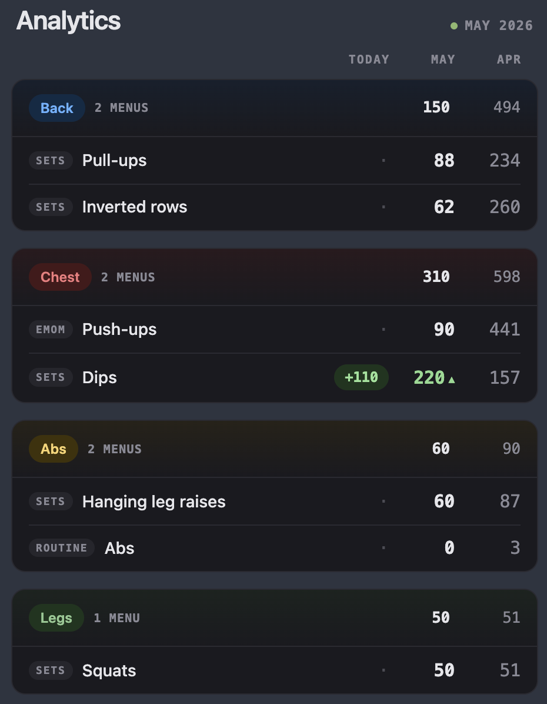
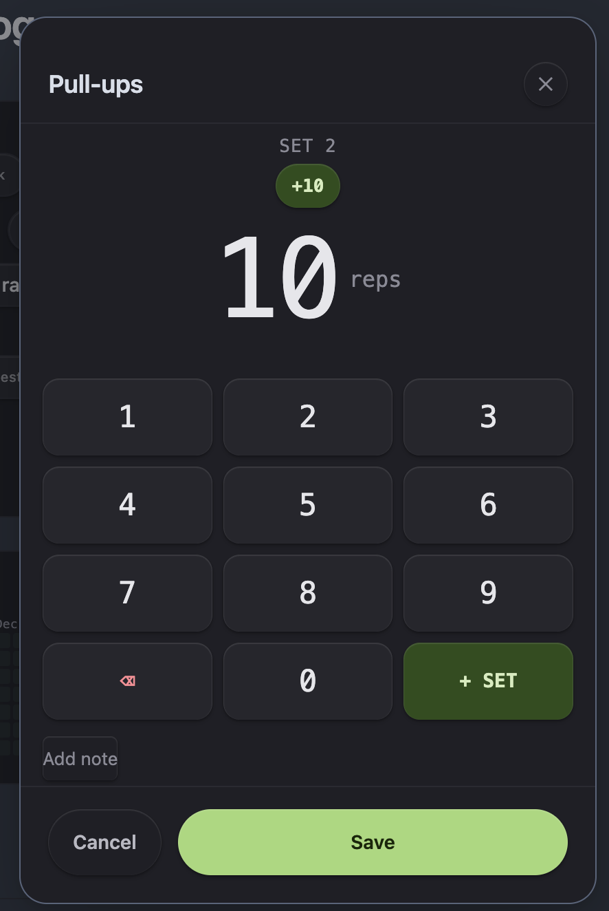

# Workout Dashboard

Obsidian プラグイン（個人利用）。ワークアウトデータを日次 `.md` ファイルの YAML frontmatter として記録し、カスタムダッシュボード UI で表示する。

## スクリーンショット

| ダッシュボード | アナリティクス | 記録モーダル |
|:-:|:-:|:-:|
|  |  | |

## 機能

- エクササイズをタイプ別（Sets / EMOM / Cardio / Routine）にグループ化したチップボード
- チップをタップして新規記録、既存行をタップして編集・削除
- ワークアウトデータは `workout/YYYY-MM-DD.md` に YAML frontmatter として保存
- 年間ワークアウト頻度をヒートマップで表示するコントリビューショングラフ
- 直近 5 日分のタイムライン（日付ごとにグループ化）
- 今日 / 今月 / 先月の実績を筋肉部位別に比較するアナリティクスカード
- 設定タブでエクササイズメニューとフォルダーパスを管理

## エクササイズタイプ

| タイプ | 入力方法 | 保存形式 |
|--------|----------|----------|
| **Sets** | 数字パッド → セットごとのレップ数をチップで入力 | レップ数の配列 |
| **EMOM** | レップ数 × セット数フィールド | `reps` と `sets` の整数 |
| **Cardio** | フリーテキスト + クイックプリセット | コメント文字列 |
| **Routine** | フリーテキストのみ | コメント文字列 |

## 筋肉部位

エクササイズには筋肉部位（`chest` / `back` / `abs` / `legs`）を設定でき、チップの色に反映される。

## セットアップ

1. このリポジトリを vault の `.obsidian/plugins/workout-dashboard/` にクローン
2. `npm i` → `npm run build` を実行
3. Obsidian の設定でプラグインを有効化
4. プラグイン設定でエクササイズを 1 件以上追加（名前・タイプ・筋肉部位）
5. コマンド **Open Workout Dashboard** またはリボンアイコンからダッシュボードを開く

## 設定

| 設定 | デフォルト | 説明 |
|------|-----------|------|
| Workout folder | `workout` | ワークアウトファイルを保存するフォルダー |
| Dashboard file | `workout/dashboard.md` | カスタムビューとして表示するファイルのパス |

エクササイズは設定で追加しないとダッシュボードに表示されない。組み込みプリセットはない（デフォルト設定に初期値あり）。

## 開発

```bash
npm run dev    # ウォッチモード — src/main.ts → main.js をソースマップ付きでバンドル
npm run build  # 型チェック + プロダクションバンドル（最小化・ソースマップなし）
npm run lint   # ESLint チェック
```

変更の確認: `main.js`・`styles.css`・`manifest.json` を vault の `.obsidian/plugins/workout-dashboard/` にコピーして Obsidian をリロード。

## データ形式

各日次ファイルは YAML frontmatter で記録される:

```yaml
---
date: 2026-05-10
exercises:
  - menu: "Pull-ups"
    type: sets
    sets: [10, 8, 6]
    comment: ""
  - menu: "Push-ups"
    type: emom
    reps: 12
    sets: 5
    comment: ""
  - menu: "Run"
    type: cardio
    comment: "5km easy"
  - menu: "Abs"
    type: routine
    comment: "プランク 3セット"
---
```

## プラグインの手動インストール

以下の 3 ファイルを vault の `VaultFolder/.obsidian/plugins/obsidian-workout/` にコピーする:
- `main.js`
- `styles.css`
- `manifest.json`
